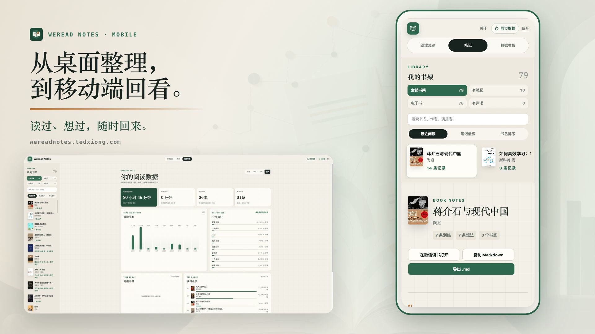
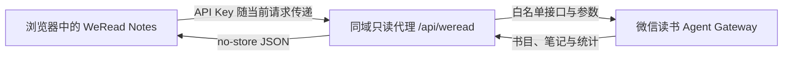

# WeRead Notes

基于微信读书官方 Agent API 的个人阅读笔记工作台。连接你的微信读书数据，在一个 Web 页面里完成完整书架检索、阅读统计、笔记回顾与 Markdown 导出。

**在线体验：[https://wereadnotes.tedxiong.com](https://wereadnotes.tedxiong.com)**

> 本项目不会修改或重新打包官方 Skill，而是使用相同的只读官方网关获取用户授权的数据。

## 产品演示

[](docs/media/weread-notes-promo-v3-29s.mp4)

**[▶ 点击观看 28.8 秒产品演示](docs/media/weread-notes-promo-v3-29s.mp4)**

演示完整路径：连接 API Key → 阅读总览 → 筛选并选择有笔记的书 → 按章节回看 → 复制 Markdown → 导出 `.md` → 数据看板 → 移动端。

## 功能

- 使用微信读书官方 API Key 连接；默认仅保存在当前页面内存，也可由用户主动选择保存在当前浏览器
- 合并笔记本与书架数据，完整展示电子书、有声书和文章收藏入口
- 按全部书架、有笔记、电子书和有声书筛选，并支持书名/作者搜索、最近阅读、笔记最多和书名排序
- 手动同步书目、当前统计周期和已打开书籍的笔记；部分接口失败时保留已有数据
- 将划线与个人想法合并后按章节组织，并可跳转到正确的微信读书 Web 阅读器页面
- 一键复制结构化 Markdown，或直接下载 `.md` 笔记文件
- 按本周、本月、今年和全部历史查看阅读时长、阅读书目与笔记总数
- 提供阅读节奏、分类偏好、24 小时阅读分布和 Top 书籍看板
- 支持桌面端与移动端，图表支持鼠标悬浮和键盘聚焦
- 支持通过微信公众号 JS-SDK 定制微信内分享卡片，并提供可按需启用的分享诊断

## 工作方式



微信读书官方网关的浏览器 CORS 只允许微信读书自身站点，因此页面通过同域服务端代理转发请求。代理只开放产品实际使用的只读接口，并拒绝未知参数、超大请求、非 JSON 响应和上游跳转。

## 快速开始

### 环境要求

- Node.js `>= 22.13.0`
- npm
- 有效的微信读书 API Key

从[微信读书 Skill 官方页](https://weread.qq.com/r/weread-skills)获取 API Key，然后运行：

```bash
git clone git@github.com:xiongwei-git/WeReadNotes.git
cd WeReadNotes
npm install
npm run dev
```

访问终端输出的本地地址，在连接页输入 API Key 即可进入工作台。

## 常用命令

```bash
# 本地开发
npm run dev

# 生产构建
npm run build

# 完整测试（包含生产构建）
npm test

# 代码与类型检查
npm run lint
npx tsc --noEmit
```

## 安全边界

- API Key 默认只保存在当前 React 内存状态中，刷新页面后即被清除
- 用户可主动选择将 API Key 以明文保存到当前浏览器的 Local Storage；仅建议在私人设备上开启
- API Key 不写入项目数据库、Session Storage、Cookie、URL 或日志
- 取消“在此浏览器保存”或主动断开会清除已保存的 API Key
- 服务端代理仅允许预设的微信读书只读 API 与参数
- 上游和页面响应使用 `Cache-Control: no-store`
- 代理请求设置 20 秒超时，并拒绝上游 3xx 跳转
- 微信公众号 `AppSecret` 仅由服务端运行时环境读取，不进入客户端、响应、日志或仓库

请勿把 API Key 写入源码、环境示例、Issue、截图或提交历史。

## 技术栈

| 层级 | 实现 |
| --- | --- |
| UI | React 19、Next.js App Router、TypeScript |
| 构建 | vinext、Vite 8 |
| 运行时 | Cloudflare Workers |
| 数据源 | 微信读书 Agent Gateway |
| 测试 | Node.js Test Runner、生产构建回归测试 |

当前版本不使用数据库、对象存储或账号系统。同步操作会重新读取官方接口，而不是在服务端维护一份用户数据副本。

## 项目结构

```text
app/
├── WeReadApp.tsx            # 工作台界面与数据加载流程
├── components/WeReadMark.tsx # 品牌图标
├── components/WeChatShareSetup.tsx # 微信内 JS-SDK 分享配置
├── api/weread/route.ts      # 微信读书同域只读代理
├── api/wechat/jssdk/route.ts # 微信公众号 JS-SDK 同源签名
├── globals.css              # 全局视觉与响应式样式
└── lib/
    ├── weread-core.ts       # 数据口径、Reader ID、笔记整理
    ├── weread-sync.ts       # 手动同步协调与错误处理
    └── weread-api-key-storage.ts # 可选的浏览器 API Key 存储
tests/                       # 单元、渲染与同步回归测试
worker/index.ts              # Cloudflare Worker 入口
docs/                        # 调研文档与项目截图
├── images/                  # README 截图与视频封面
└── media/                   # 产品介绍视频
scripts/baota-update.sh      # 宝塔安全更新与生产构建脚本
```

## 部署

当前生产环境：[https://wereadnotes.tedxiong.com](https://wereadnotes.tedxiong.com)

执行 `npm run build` 会生成 `dist/` 产物，当前项目可通过 `npm run start` 启动 vinext Node 服务，也保留了 Cloudflare Worker 构建配置。项目本身不需要配置微信读书 API Key 环境变量，因为 Key 由用户在浏览器中提供。

使用宝塔面板在 Linux 服务器上安装依赖、构建，并通过 PM2 与 Nginx 运行时，请参考[宝塔面板构建与部署教程](docs/BAOTA_DEPLOY.md)。微信分享卡片还需要配置公众号 JS 接口安全域名、服务器 IP 白名单，以及仅通过服务器环境读取的 `WECHAT_APP_ID` 和 `WECHAT_APP_SECRET`。

已部署的宝塔服务器可以运行以下脚本完成后续更新与构建；脚本成功后，再到宝塔 Node 项目中重启服务：

```bash
bash scripts/baota-update.sh
```

## 当前限制

- 不提供跨设备账号与数据持久化
- 不保存历史同步快照，数据以微信读书接口当前返回为准
- “同步数据”表示重新请求官方数据，并非触发微信读书服务端缓存刷新
- 微信读书 Agent API 或 Web Reader ID 规则发生变化时，项目可能需要同步更新
- 微信分享卡片依赖公众号 JS-SDK 权限、JS 接口安全域名、服务器 IP 白名单和有效 AppSecret

## 相关资料

- [微信读书 Skill 官方页](https://weread.qq.com/r/weread-skills)
- [Tencent/WeChatReading](https://github.com/Tencent/WeChatReading)
- [v2cb 公开前端数据链路调研](docs/v2cb-data-flow.md)

## 许可证

本项目采用 [Apache License 2.0](LICENSE)。

## 免责声明

WeRead Notes 是独立的个人项目，与腾讯或微信读书没有隶属或官方合作关系。请仅处理你有权访问的数据，并遵守微信读书的服务条款与接口使用要求。
