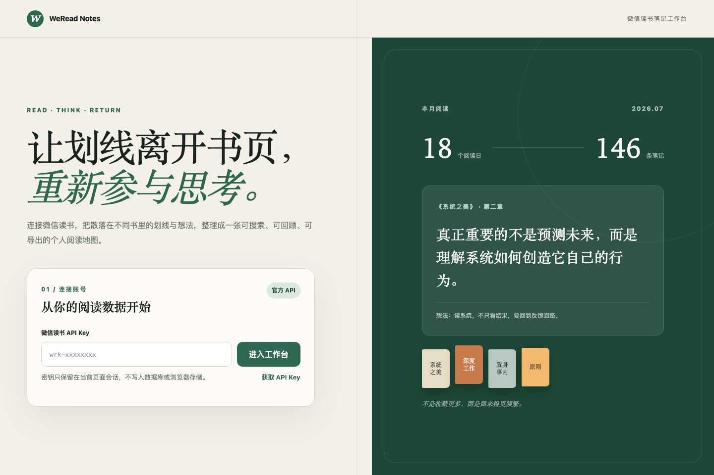
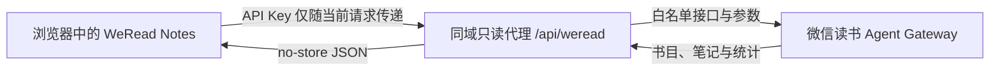

# WeRead Notes

基于微信读书官方 Agent API 的个人阅读笔记工作台。连接你的微信读书数据，在一个 Web 页面里完成书目检索、阅读统计、笔记回顾与 Markdown 导出。

> 本项目不会修改或重新打包官方 Skill，而是使用相同的只读官方网关获取用户授权的数据。



## 功能

- 使用微信读书 API Key 连接个人阅读数据
- 手动同步书目、阅读统计和当前书籍笔记
- 按书名或作者搜索，并支持最近阅读、笔记最多、书名排序
- 将划线和个人想法合并后按章节组织
- 展示本周、本月、今年和全部历史的阅读数据
- 提供阅读节奏、分类偏好、24 小时阅读分布与 Top 书籍看板
- 一键跳转到正确的微信读书 Web 阅读器页面
- 复制或下载结构化 Markdown 笔记
- 支持桌面端与移动端，图表支持鼠标悬浮和键盘聚焦

## 工作方式



微信读书官方网关的浏览器 CORS 只允许微信读书自身站点，因此页面通过同域服务端代理转发请求。代理只开放产品实际使用的只读接口，并拒绝未知参数、超大请求、非 JSON 响应和上游跳转。

## 快速开始

### 环境要求

- Node.js `>= 22.13.0`
- npm
- 有效的微信读书 API Key

从[微信读书 Skill 官方页](https://weread.qq.com/r/weread-skills)获取 API Key，然后运行：

```bash
git clone git@github.com:xiongwei-git/WeReadNotes.git
cd WeReadNotes
npm install
npm run dev
```

访问终端输出的本地地址，在连接页输入 API Key 即可进入工作台。

## 常用命令

```bash
# 本地开发
npm run dev

# 生产构建
npm run build

# 完整测试（包含生产构建）
npm test

# 代码与类型检查
npm run lint
npx tsc --noEmit
```

## 安全边界

- API Key 只保存在当前 React 内存状态中
- 不写入数据库、Local Storage、Session Storage、Cookie、URL 或日志
- 刷新页面或主动断开后，内存中的 API Key 即被清除
- 服务端代理仅允许预设的微信读书只读 API 与参数
- 上游和页面响应使用 `Cache-Control: no-store`
- 代理请求设置 20 秒超时，并拒绝上游 3xx 跳转

请勿把 API Key 写入源码、环境示例、Issue、截图或提交历史。

## 技术栈

| 层级 | 实现 |
| --- | --- |
| UI | React 19、Next.js App Router、TypeScript |
| 构建 | vinext、Vite 8 |
| 运行时 | Cloudflare Workers |
| 数据源 | 微信读书 Agent Gateway |
| 测试 | Node.js Test Runner、生产构建回归测试 |

当前版本不使用数据库、对象存储或账号系统。同步操作会重新读取官方接口，而不是在服务端维护一份用户数据副本。

## 项目结构

```text
app/
├── WeReadApp.tsx            # 工作台界面与数据加载流程
├── api/weread/route.ts      # 微信读书同域只读代理
├── globals.css              # 全局视觉与响应式样式
└── lib/
    ├── weread-core.ts       # 数据口径、Reader ID、笔记整理
    └── weread-sync.ts       # 手动同步协调与错误处理
tests/                       # 单元、渲染与同步回归测试
worker/index.ts              # Cloudflare Worker 入口
docs/                        # 调研文档与项目截图
```

## 部署

执行 `npm run build` 会生成可由 Cloudflare Worker 运行的 `dist/` 产物。部署环境需要支持项目当前的 vinext 与 Cloudflare Worker 配置；项目本身不需要配置微信读书 API Key 环境变量，因为 Key 由用户在页面会话中提供。

## 当前限制

- 不提供跨设备账号与数据持久化
- 不保存历史同步快照，数据以微信读书接口当前返回为准
- “同步数据”表示重新请求官方数据，并非触发微信读书服务端缓存刷新
- 微信读书 Agent API 或 Web Reader ID 规则发生变化时，项目可能需要同步更新

## 相关资料

- [微信读书 Skill 官方页](https://weread.qq.com/r/weread-skills)
- [Tencent/WeChatReading](https://github.com/Tencent/WeChatReading)
- [v2cb 公开前端数据链路调研](docs/v2cb-data-flow.md)

## 许可证

本项目采用 [Apache License 2.0](LICENSE)。

## 免责声明

WeRead Notes 是独立的个人项目，与腾讯或微信读书没有隶属或官方合作关系。请仅处理你有权访问的数据，并遵守微信读书的服务条款与接口使用要求。
