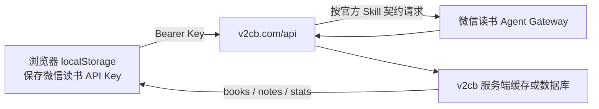
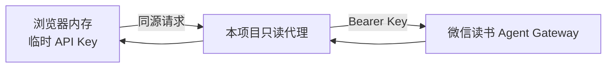

# v2cb 数据链路分析

检查时间：2026-07-22

## 结论

v2cb 的浏览器端没有直接调用微信读书官方网关，而是调用 `https://v2cb.com/api` 下的自有接口。结合开发者公开说明，数据源几乎可以确定是微信读书官方 Skill 所公开的 Agent API；但具体的服务端实现没有开源，因此无法确认其缓存表结构、保留周期和 API Key 是否在服务端持久化。

这里的“使用 Skill”更准确地说是：服务端按官方 Skill 文档中的 HTTP 契约调用微信读书 Agent Gateway，而不是在每次同步时运行 `npx skills add`。

## 公开前端可验证的事实

前端静态资源：<https://v2cb.com/yueli-assets/index-DokpTvA7.js>

- API 基址固定为 `https://v2cb.com/api`。
- 原始 API Key 保存在浏览器 `localStorage` 的 `weread_api_key` 中。
- 每次请求使用 `Authorization: Bearer <API Key>` 发给 v2cb 自有后端。
- 前端公开路由包括：
  - `POST /api/sync`
  - `GET /api/sync/status`
  - `GET /api/books`
  - `GET /api/books/{bookId}/notes`
  - `GET /api/notes/dates`
  - `GET /api/stats/data?mode=...`
  - `GET /api/stats/shelf`
- 触发同步后，前端每 2 秒轮询一次 `/sync/status`，同步结束后再刷新书籍与笔记数据。
- 前端资源中不存在 `i.weread.qq.com`、`/api/agent/gateway`、`api_name`、`skill_version` 或官方原子接口路径。
- 未携带 Key 请求 `/api/books` 和 `/api/sync/status` 均返回 `401 missing API key`。

## 合理推断

依据：

1. 开发者公开表示是在“微信读书开放 Skill”后制作这个网站。
2. 浏览器只认识 v2cb 自有的聚合接口，不认识微信读书原子接口。
3. `/sync`、轮询状态、随后读取 `/books` 的流程表明服务端进行了批量抓取和整理。
4. 首次同步可能较慢，而后续直接读取 `/books` 和单本笔记，符合服务端缓存或持久化后的使用方式。

## 与本项目的差异

本项目当前采用无持久化方案：

- API Key 不进入 `localStorage` 或数据库。
- 服务端不建立用户数据副本，每次读取实时访问官方接口。
- 隐私边界更简单，但首次加载和大批量笔记读取会比缓存方案慢。
- 如果未来增加跨设备同步，应先明确 Key 加密、撤销、数据保留和删除策略，再引入数据库。

## 参考

- [v2cb 首页](https://v2cb.com/)
- [开发者公开动态](https://m.okjike.com/users/BFEEA634-D661-4951-8931-DCC7D1D98D16)
- [微信读书官方 Skill 仓库](https://github.com/Tencent/WeChatReading)
